# genesis

**A sandbox world where intelligence is grown, not coded — and the same engine carries
that world from 1D to 2D to 3D.**

> New here? Read [**docs/CAPSTONE.md**](docs/CAPSTONE.md) for the one-page "what is this" — what
> 41 autonomous rounds produced, what is honestly *not* there, and where it goes next.

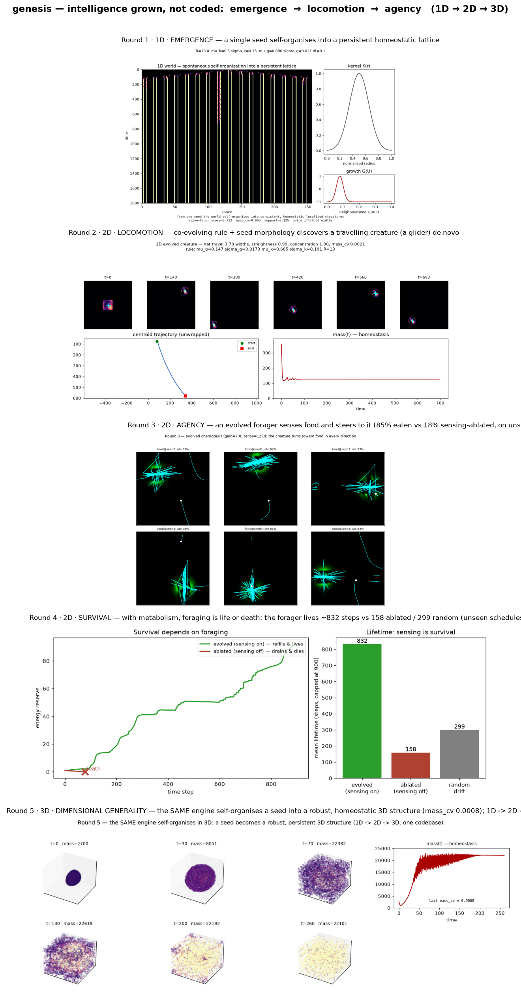

The substrate is a continuous cellular automaton (Lenia family): the world is an
N-dimensional real-valued field, and one update is a radial-kernel convolution followed
by a growth map.

```
U = K * A                # neighbourhood sum (circular FFT convolution)
A = clip(A + dt * G(U))  # growth toward a preferred neighbourhood
```

Because the kernel and convolution are built from `shape` alone, the *identical* code
runs in any dimension — `len(shape)` **is** the world's dimensionality. Nothing above
the engine is hand-placed: persistent structure, locomotion, evolution and agency all
*emerge* from local rules and selection.

From that one substrate, ~41 rounds grow a world and, inside it, a mind: structure
**emerges**, a creature learns to **move** and **forage**, a population **evolves**, a
second species **hunts**, a brain **learns** within a life, then comes to **remember**,
**predict**, and **act on its foresight** — closing the loop *perceive → model → predict →
act-to-achieve*. Those faculties are then **integrated into one organism** (round 21), the
substrate is shown to keep **generating a zoo of distinct creatures** rather than converging
(rounds 22/24 — body shape *and* foraging strategy), and — once the world holds two agents — a
**shared language emerges** and becomes **compositional** (rounds 30/31). Each capability is shown
with a runnable driver, a figure, and a metric.

> **Honest scope.** These are *focused demonstrations*, not one organism doing everything at
> once: the deep-mind results (memory, prediction, planning) are isolated in the settings that
> make them measurable, embodied in the Lenia creature where that's the point (agency, survival,
> embodied memory). It is small-scale and CPU/`numpy`-only — not competitive with engineered
> agents. And the **mobile 3D *creature*** (a 3D glider) is an open negative — round 25 finds a
> *stable compact* 3D creature but not a *moving* one. Every round's honest negatives are kept,
> not hidden.

## The arc so far

| # | Frontier | Status |
|---|----------|--------|
| 1 | **Emergence** — self-maintaining structure from local rules | ✅ round 1 (1D) |
| 2 | **Locomotion** — a creature that travels | ✅ round 2 (evolved 2D glider) |
| 3 | **Agency** — sense the world and act to pursue a goal | ✅ round 3 (evolved forager) |
| 4 | **Survival** — forage to stay alive, or die | ✅ round 4 (metabolism) |
| 5 | **3D** — the same engine, one more axis | ✅ round 5 (3D self-organisation) |
| 6 | **Ecology** — many creatures compete for food | ✅ round 6 (stabilizing selection) |
| 7 | **Evolution running** — the population self-tunes | ✅ round 7 (discovers the optimum) |
| 8 | **Predator–prey** — a world that pushes back | ✅ round 8 (top-down regulation) |
| 9 | **Learning** — a creature adapts within its life | ✅ round 9 (reversal learning) |
| 11 | **Embodied learning** — the brain inside the body | ✅ round 11 (body + agency + learning) |
| 12 | **Measuring the mind** — intelligence in bits | ✅ round 12 (I(brain;world) = 0.69 bits) |
| 13 | **Learning under selection** — does knowing win? | ✅ round 13 (yes — in a changing world) |
| 14 | **The Baldwin effect** — evolving how to learn | ✅ round 14 (rate self-tunes; honest negative) |
| 15 | **A brain with memory** — holding a cue across a delay | ✅ round 15 (1 bit of memory; reflex can't) |
| 16 | **A brain that predicts** — foreseeing the next state | ✅ round 16 (1 bit predictive info; reflex can't) |
| 18 | **Embodied memory** — a recurrent brain in a Lenia body | ✅ round 18 (memory pays: ~2× foraging) |
| 19 | **Planning** — acting on foresight to intercept | ✅ round 19 (planner 2× faster; the loop is whole) |
| 21 | **Unification** — one creature, all four faculties | ✅ round 21 (ablate any → it starves; each load-bearing) |
| 22 | **Open-endedness** — keep generating, or converge? | ✅ round 22 (MAP-Elites zoo: 54/64 niches vs 1) |
| 24 | **Open-ended minds** — a zoo of foraging strategies | ✅ round 24 (28 distinct strategies vs ~5) |
| 25 | **The 3D creature** — a compact body in 3D; a mover? | ◑ round 25 (compact body found; mobile glider still open) |
| 27 | **Flow-Lenia** — a mass-conserving substrate (numpy) | ✅ round 27 (exact conservation; robust 3D; multi-creature) |
| 28 | **Why it won't move** — diagnosing the motion negative | ✅ round 28 (gradient flow relaxes; needs multi-channel) |
| 29 | **Multi-channel Flow-Lenia** — coupled channels | ◑ round 29 (built + coupled creatures; motion still walled off) |
| 30 | **Emergent communication** — two agents, a shared code | ✅ round 30 (a language emerges: 2 bits, ablation-proven) |
| 31 | **Compositional communication** — does it factorise? | ✅ round 31 (holistic by default; structured under pressure) |
| 33 | **Grounded communication** — a signal that drives foraging | ✅ round 33 (blind forager forages only with the channel) |
| 34 | **Iterated learning** — compositionality from transmission | ✅ round 34 (Kirby: structure emerges from a bottleneck) |
| 35 | **Theory of mind** — infer a hidden goal from behaviour | ✅ round 35 (belief sharpens; ablate observation → chance) |
| 37 | **Multi-agent coordination** — division of labour | ✅ round 37 (team covers all sites; identical agents collide) |
| 38 | **Harder theory of mind** — intent when behaviour misleads | ✅ round 38 (detour fools the position oracle; modelling wins) |
| 40 | **Unified social world** — communicate AND coordinate | ✅ round 40 (both faculties load-bearing; the social-arc capstone) |
| 41 | **Cumulative culture** — the ratchet | ✅ round 41 (an artifact ratchets into a star no lifetime could build) |

---

## Round 1 — emergence (1D)

From a single seed, the world spontaneously self-organises into a **persistent,
homeostatic lattice** of localised structures (mass coefficient-of-variation ≈ 0).
Directed motion appears but is *transient* — a measured finding that persistent gliders
are a 2D phenomenon.

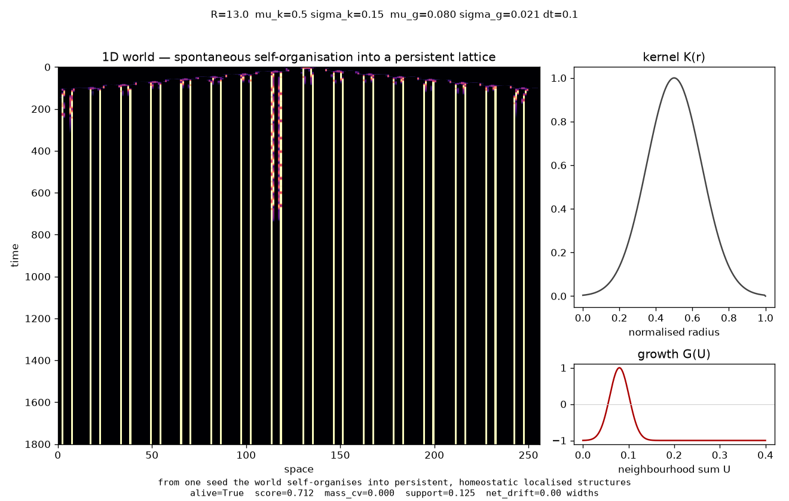

## Round 2 — locomotion (2D)

We **co-evolve the rule and the seed morphology** under a locomotion objective, and
selection discovers a genuine **glider** de novo: a single compact body that crosses the
field in a near-straight line (net travel ≈ 3.8 widths, straightness 0.99) while holding
constant mass. Orbium is *not* hardcoded; the creature is found.

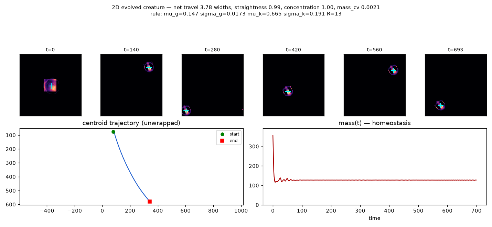

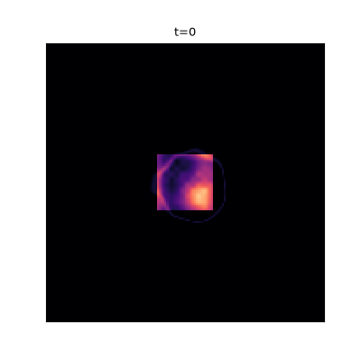

> Lesson, caught twice by *looking* rather than trusting a metric: a glider is a narrow
> attractor (no Gaussian blob reaches it under any rule → the seed shape must be evolved),
> and a space-filling "soup" games naive travel/support metrics → a scale-aware
> **mass-concentration** gate is required to mean "one creature."

## Round 3 — agency (2D)

The glider gets a **sensorimotor reflex**: it senses the food gradient over its body and
drifts up it (a mass-exact `np.roll` translation — the body stays an emergent Lenia
creature). We evolve the reflex and benchmark it on **unseen** random food layouts:

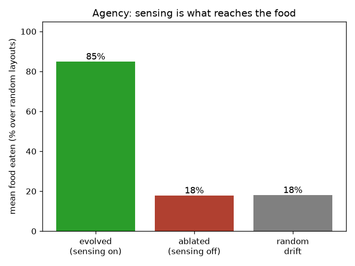

The evolved forager eats **85%** of the food vs **18%** for the sensing-ablated body and
**18%** for a creature that drifts the same amount in a *random* direction. The random
control is the clincher — equal motion, no food-sensing, no better than ablated — so the
advantage is specifically *food-directed* sensing, not movement. The creature turns
toward food **in every direction**, then stays and consumes it:

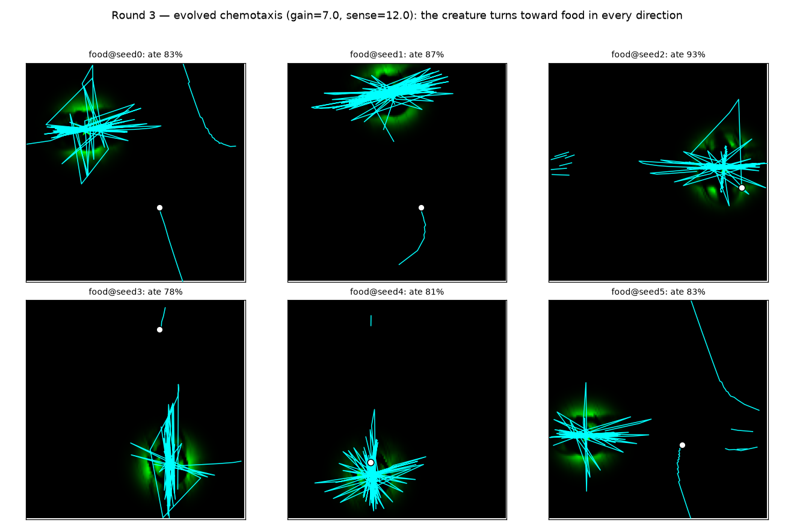

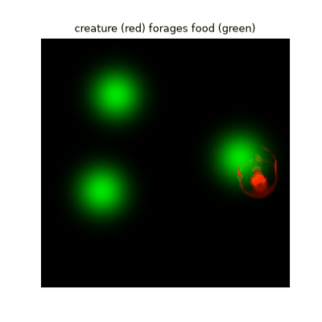

*(red = creature, green = food)*

## Round 4 — survival (2D)

Now metabolism is on: the creature carries an **energy reserve** that drains every step
and is refilled only by eating; when it hits zero the body dissipates and the creature
**dies**. Food appears at random places over time, so staying alive demands *continual,
aimed* foraging. We evolve the forager to maximise lifetime and benchmark on **unseen**
food schedules:

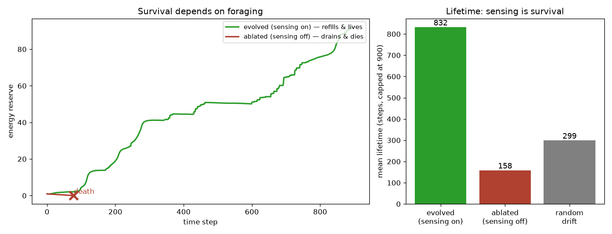

The evolved forager banks an energy surplus and lives indefinitely (≈ **832** of 900
steps), while the sensing-ablated body starves at **158** and a random-drifter at **299**.
Intelligence now has teeth — it is the difference between living and dying.

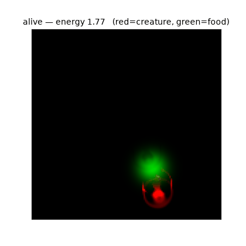

## Round 5 — the third dimension (3D)

The whole engine was built so dimensionality is just `len(shape)`. Here the **identical
code** runs a 3D world, and a single seed spontaneously self-organises into a **robust,
persistent 3D structure** — homeostatic mass (`mass_cv ≈ 0.0008`), reproducible across
seeds. This completes the **1D → 2D → 3D** arc on one codebase.

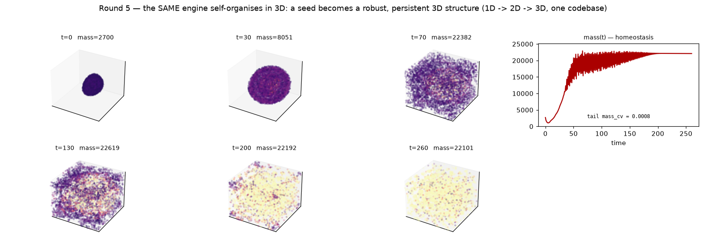

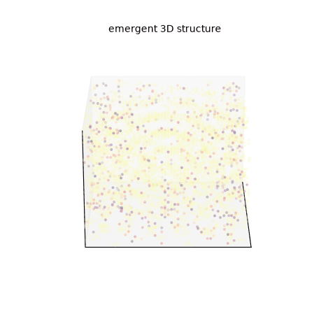

> Honest scope: a *compact, mobile* 3D creature (the 3D analogue of the 2D glider) is **not**
> delivered. Across five search strategies (single/multi-ring kernels, growth-width sweeps,
> evolved 3D morphology) the reachable 3D dynamics are knife-edge — they die, foam, or
> proliferate, and flip on grid size and seed. Stable localised 3D creatures need the heavy
> specialised search the 3D-Lenia literature uses. What is solid here is robust 3D
> *self-organisation*; the 3D *creature* is an open frontier. **(Round 25 advances this: a stable
> *compact* 3D creature is now found, but a *mobile* 3D glider is still the open negative.)**

## Round 6 — ecology (2D)

Many creatures now share **one world and one finite food field** — each is a Lenia body
in its own channel, with its own energy and foraging reflex, and food eaten by one is
denied to the others (exploitation competition). Sweeping foraging skill across the
population reveals **stabilizing selection**: survival peaks at an *intermediate* skill —
under-foragers can't find food and starve, over-foragers overshoot and forage
inefficiently. The optimum sits at gain ≈ 4 and is robust across food-scarcity regimes.

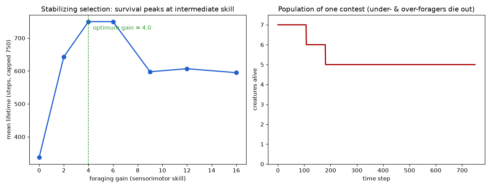

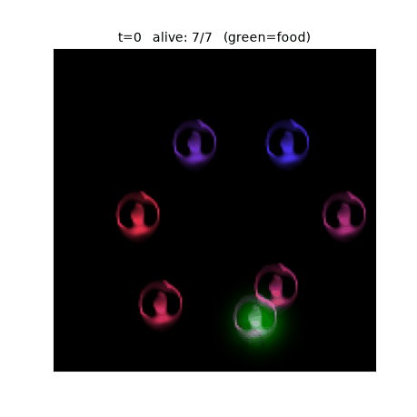

*(creatures coloured by foraging skill — red = low, blue = high; green = food)*

## Round 7 — evolution running (2D)

In round 6 we *measured* the fitness landscape by hand. Here selection **runs**: foraging
gain is a **heritable gene**, well-fed creatures **reproduce** (offspring inherit the gain
plus a mutation), and starving ones die. Under scarce food the population is food-limited,
so foraging skill decides who reproduces — and starting from **random** gains, the
population **discovers the optimum on its own**: mean gain converges to ≈ 3.5 across
independent runs, matching round 6's independently-swept optimum (~4). Two methods, one answer.

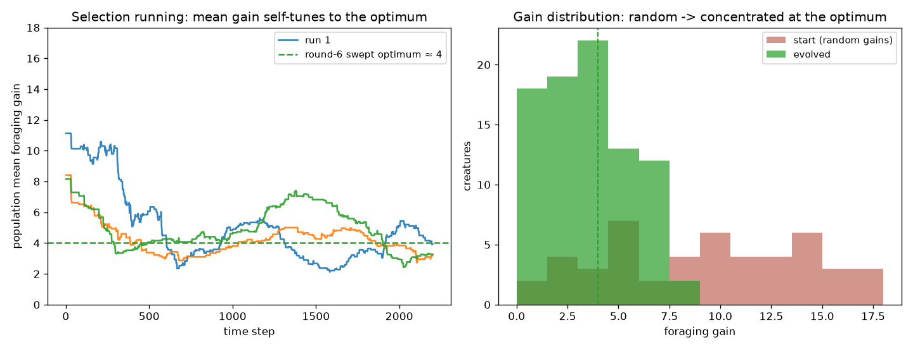

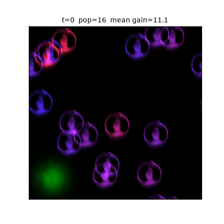

*(population colour = foraging gain; over time it shifts toward the optimal strategy)*

## Round 8 — predator & prey (2D)

A **second species** now hunts the foragers. Prey forage food *and* flee predators;
predators sense the prey-density field, chase it, and eat prey into their own energy.
Both carry energy, reproduce, and have a heritable strategy gene. The world starts to
push back:

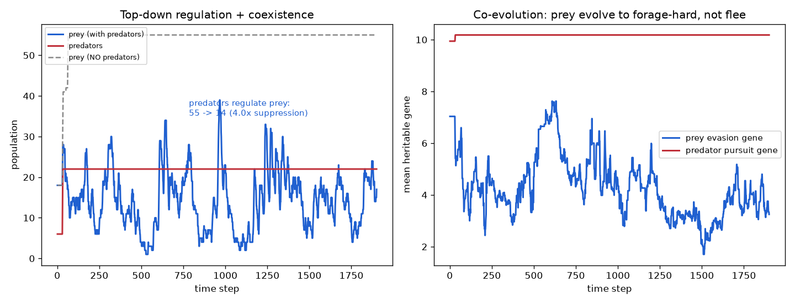

- **Top-down regulation:** predators hold the prey population at ~14, four times below
  its predator-free ceiling of ~55 — the prey's very numbers are now set by something
  hunting it, and the prey shows vivid boom-bust fluctuations.
- **Co-evolution (the honest surprise):** selection acts, but prey evolve *lower* evasion
  (7 → 3), not higher — fleeing costs more foraging than it saves, so "forage hard and
  out-breed predation" wins. The evolved answer to predators is fecundity, not flight.
  *(A clean escalating arms race did not emerge — documented honestly; see `docs/progress.md`.)*

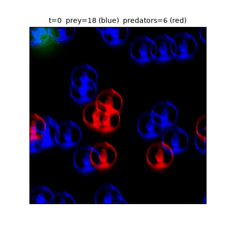

*(prey = blue, predators = red, food = green)*

## Round 9 — within-lifetime learning (2D)

Everything so far was a *fixed reflex* whose gain evolution set across generations. Here a
creature carries a **plastic brain** and adapts during a *single life*. The task is
**reversal learning**: two food sources, only one nutritious at a time, and the rule
**flips** every 320 steps. The learner tracks the rewarding source and — crucially —
**re-learns after every reversal**, something no fixed or purely-evolved policy can do:

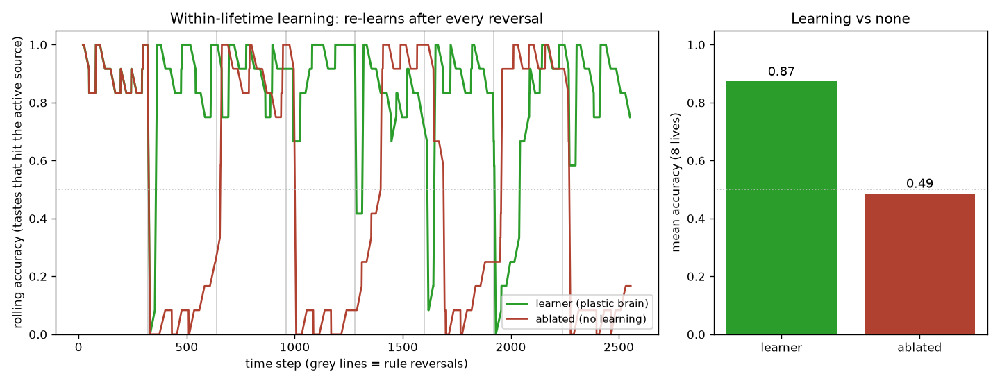

Accuracy **0.87** for the plastic brain vs **0.49** (chance) for the *same* creature with
plasticity switched off. The curve dips at each reversal (grey lines) and recovers — the
hallmark of learning within a lifetime, not across generations.

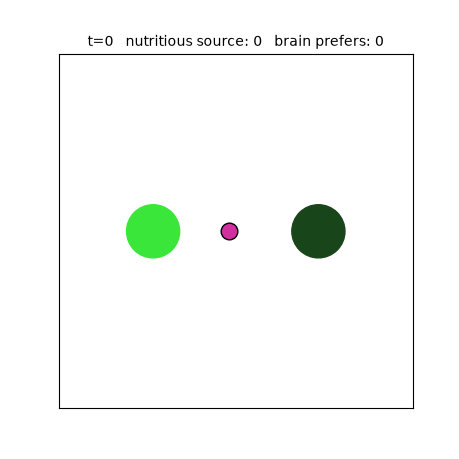

*(the agent follows whichever source is currently nutritious as the rule flips)*

## Round 11 — embodied learning (2D)

Rounds 2–8 gave a creature a *body* and a *fixed* foraging reflex; round 9 gave a *brain*
that learns, but in a detached point agent. Round 11 puts them together: the plastic brain
lives **inside a Lenia creature**. The creature forages two food types, its drift is a
plastic policy `w_A·∇F_A + w_B·∇F_B`, only one type is nutritious, and the rule reverses
mid-life (food evaporates if uneaten, so it must actively forage).

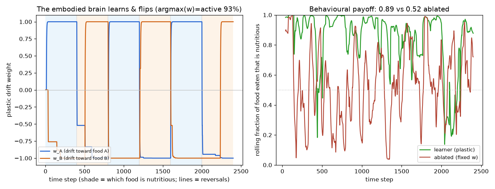

The drift weights **flip with the rule** (the brain prefers the correct food **93%** of the
time, re-learning after each reversal), and the embodied learner eats **0.89** nutritious food
vs **0.52** for the same body with plasticity off. Body (round 2) + agency (round 3) +
within-life learning (round 9), united in **one creature**.


*(magenta = the Lenia creature; the nutritious food type is shown brighter; it flips mid-life)*

## Round 12 — measuring the mind (bits)

Task scores ("0.89 nutritious") say a creature *does well*; they don't say its mind *knows*
anything. So we measure knowing: the **mutual information `I(brain ; world)`**, in bits,
between the creature's internal state (which food its brain prefers) and the world's hidden
variable (which food is nutritious).

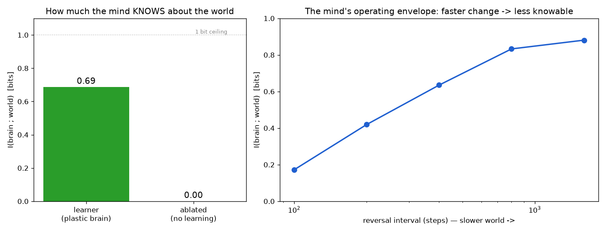

The learner's brain carries **0.69 bits** about the world; the same body with plasticity off
carries **0.00**. And sweeping how fast the world reverses traces the mind's **operating
envelope** — knowledge rises from 0.17 bits (a world that changes faster than it can learn)
to 0.88 bits (a slow world, near the 1-bit ceiling). The mind, *measured*, not asserted.


*(left: the creature foraging; right: a live "knowledge meter" — recent `I(brain;world)` rising and falling as it learns and the world flips)*

## Round 13 — learning under selection (2D)

Round 12 showed learners *know* more. Does knowing make them *win*? Learners (plastic brains)
and fixed-reflex creatures (a non-plastic, inherited strategy) **compete in one world** for two
food types, with `is_learner` heritable and the nutritious type reversing at a tunable rate:

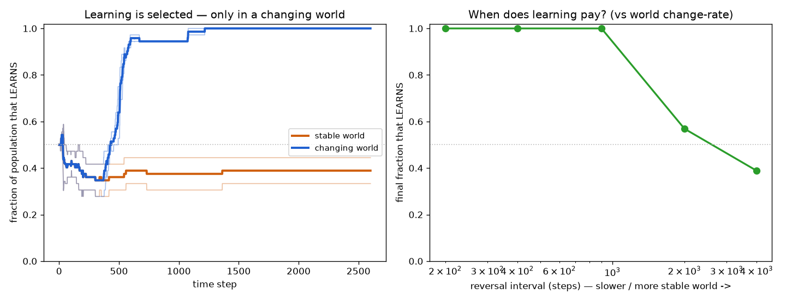

The answer is conditional and clean — the **evolution-of-learning (Baldwin)** result:
- In a **changing** world, the learner fraction rises **0.5 → 1.0** — learning takes over.
- In a **stable** world, it falls **0.5 → 0.39** — fixed reflexes win, because learning's
  startup cost buys nothing when the world never changes.
- The change-rate sweep shows a sharp transition: **learning pays only in worlds that change
  within a lifetime.** Knowing more makes a creature win — conditionally.


*(blue = learners, red = fixed-reflex creatures, green = food; in a changing world the blue learners take over)*

## Round 14 — the Baldwin effect (2D)

If learning is selected, can evolution tune *how* to learn? The **learning rate** is now a
heritable gene — each creature is born naive and learns at its own inherited rate, which
mutates and is selected:

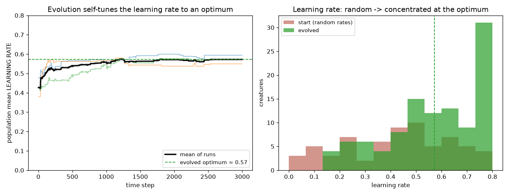

From **random** learning rates, the population self-tunes to a consistent optimum (~0.57),
shifting from a uniform spread to a concentration at higher rates — evolution discovers a
good amount of plasticity (favouring fast learning in this changing world). The Baldwin
effect operates on the learning rate itself.

> **Honest negative:** I expected the evolved rate to *track* how fast the world changes
> (the textbook volatility→learning-rate law). It does **not** here — across change rates
> from 80 to 3000 steps, and with added reward noise, the evolved rate stays ~0.5. A
> memoryless, embodied learner washes out the clean Bayesian relationship. Recorded as-is
> rather than tuned to fit the story (see `docs/progress.md`).


*(creatures coloured by learning rate — red = slow learner, blue = fast)*

## Round 15 — a brain with memory (recurrent controller)

Every controller so far was a *memoryless reflex* — `action = f(current sensation)`. Round 15
gives the brain a **hidden recurrent state** and tests it on a task that *requires* memory:
**cue recall** — a cue appears, vanishes, and after a random delay the creature must act on
the cue it can no longer see. The recurrent weights are evolved (an evolution strategy, pure
numpy):

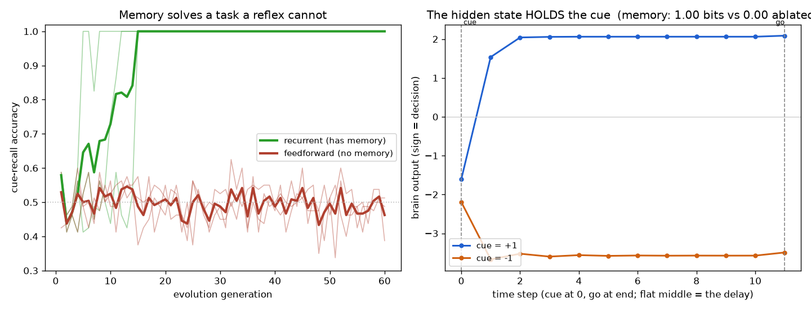

The recurrent net reaches **100%** recall and holds exactly **1.00 bit** of memory across the
delay (the two cue trajectories separate and stay separated, flat, through the whole delay).
A **feedforward** net with recurrence ablated is stuck at **chance** and holds **0.00 bits** —
it cannot, the cue is gone when it must act. **Memory unlocks a class of mind a reflex can't
reach**, and the memory is both *measured* (1 bit) and *visible* in the hidden state.

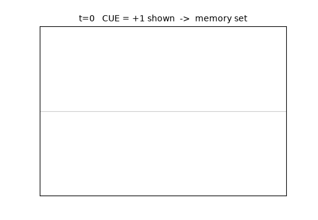

*(the cue sets the memory, the memory persists through the delay, then the correct action fires)*

## Round 16 — a brain that predicts (recurrent model)

Remembering the past is one depth; foreseeing the future is the next. The world emits a
periodic **ambiguous** pattern `[0,0,1,1]` — a `0` is followed by `0` at one phase and `1`
at another, so the current symbol *doesn't* determine the next. To predict it you must track
the phase and *model* the pattern. The recurrent weights are evolved (pure numpy ES):

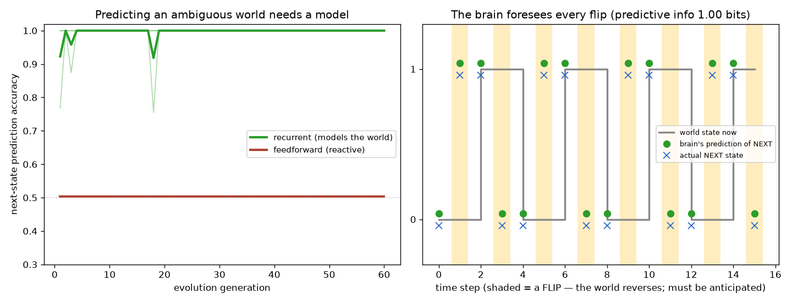

The recurrent brain reaches **100%** next-state prediction and carries a full **1.00 bit of
predictive information** about the future — anticipating *every flip before it lands*. A
feedforward (reactive) brain is at **chance / 0.00 bits** — it can't disambiguate. The brain
builds an internal model and **foresees** the world, measured in bits.

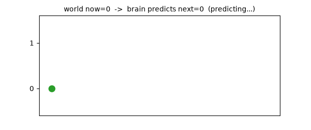

*(the brain calls the next symbol before it arrives — even at the flips)*

## Round 18 — embodied memory (the two tracks reunited)

Rounds 15–16 grew a *mind* (memory, prediction) in clean benchmarks; rounds 3–13 grew a
*body* (a Lenia forager). Round 18 puts them together: a **recurrent brain drives a Lenia
forager's drift**, in a world that **flashes** — the food gradient is visible only briefly,
then dark while the food stays put. To reach food you must *remember* the direction and
coast through the dark:

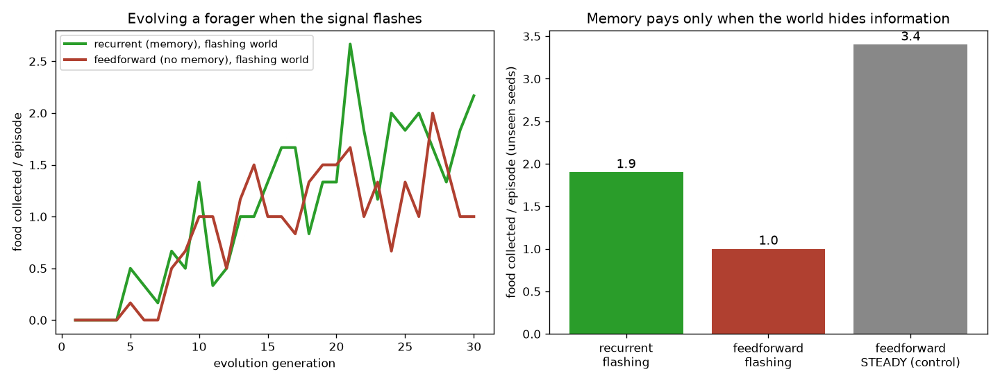

A **steady** signal lets even a memoryless forager thrive (**3.4** food/episode). **Flashing
hurts it** (the figure's seeds: → **1.0**). **Memory recovers much of that** (→ **1.9**). So
memory isn't a free upgrade — it **pays when the world hides information across time**, and the
body + the deep brain are now *one creature*.

> Honest caveat (verified in the round-20 review): this is the **most seed-sensitive** result in
> the project. Averaged over 4 independent evolution seeds the recurrent forager collects **~1.9**
> vs **~1.2** for the memoryless one and wins **3 of 4** seeds — a real, moderate effect, *not* the
> clean 2× the single figure suggests; an under-trained or unlucky seed can erase it. The direction
> (memory helps under a flashing signal) is robust; the magnitude is modest.

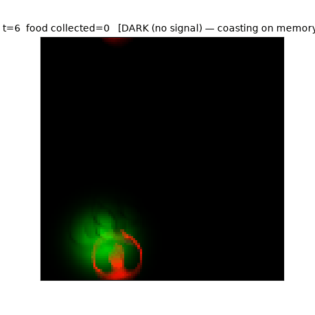

*(red = the Lenia creature, green = food; it keeps moving to food even when the signal is dark)*

## Round 19 — planning (acting on foresight)

A mind that *predicts* the future is one thing; a mind that *acts on* that prediction to
achieve a goal is the capstone. A target orbits on a circle and an agent must intercept it.
A **reactive** pursuer heads at where the target *is* and tail-chases around the circle; a
**planner** heads where it *will be* and cuts across:

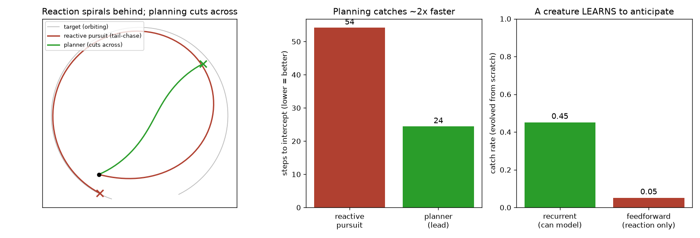

The planner intercepts in **24** steps vs **54** for reactive pursuit (~2× faster) — the
classic pursuit-curve-vs-interception picture. And an **evolved recurrent** controller (which
sees only the relative position, so it must *infer* the target's motion) **learns to
anticipate** — catch rate **0.45** vs **0.05** for a feedforward, reaction-only controller.

This completes the mind's core loop: **perceive → model → predict → act-to-achieve.** Across
the arc the creature came to **react** (rounds 3–13), **remember** (15), **predict** (16), and
now **intend** (19) — all grown from local rules, and where it matters, shown to pay.

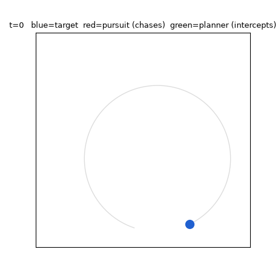

*(blue = target, red = reactive pursuit, green = planner cutting across to intercept)*

## Round 21 — unification (one creature, all four faculties)

The arc demonstrated each faculty in isolation. This round puts them in **one organism** on
one survival task that needs all of them: a Lenia creature must **stay on food that moves**
(constant-velocity, bouncing off the walls) **and flashes** (visible briefly, then dark),
under metabolism — so tracking it is literally staying alive. One integrated controller runs
the whole loop: **perceive** the food when visible → **remember** where it is across the dark
→ **predict** where it moved (dead-reckon by the remembered velocity) → **plan/act** by driving
the body's drift to the lead point.

Then we **ablate** each faculty and watch survival fall:

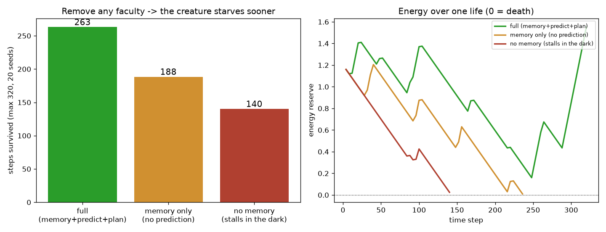

| controller | faculties | steps survived (max 320) |
|---|---|---|
| **full** | memory + prediction + planning | **263** |
| memory only | remembers, but doesn't predict the motion → aims at a stale spot | 188 |
| no memory | retains nothing across the dark → stalls when food is invisible | 140 |

Every step down the ladder removes one faculty and **costs survival** — so each one is
load-bearing. The body (rounds 3–13), memory (15/18), prediction (16) and planning (19) are
now demonstrably **one creature**.

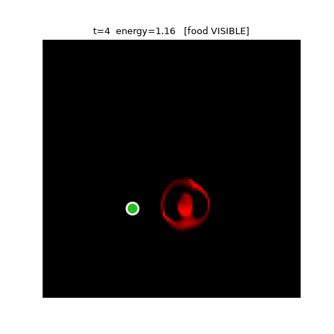

*(red = the Lenia creature; green dot = food, dim when its signal is dark — the creature keeps
tracking it on memory + prediction)*

> Honest note: the integrating controller here is **hand-wired**, not evolved — the faculties
> were each shown *evolvable* in earlier rounds (15/16/19), but a single tiny ES-trained net
> couldn't learn all four jointly, so unification proves they **compose and each is necessary**
> rather than re-deriving them. The prediction lead can also overshoot at a wall bounce, so
> `full` wins on average (and on 10/16 seeds) rather than on every single one.

## Round 22 — open-endedness (does the world keep generating?)

Every round so far **converges** — to the glider, the optimum, the intercept. Convergence is
the opposite of open-endedness. So: can this substrate keep producing *qualitatively different*
creatures? We **illuminate** a 2-D behaviour space — (how much a creature **moves**) × (how
**big** it is) — with **MAP-Elites**, keeping the most viable creature in each niche, and
compare against a fitness GA:

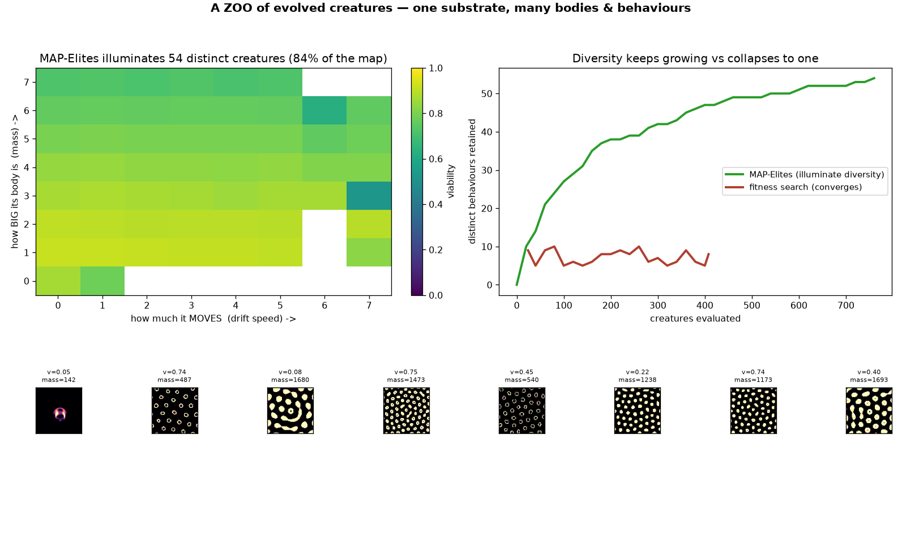

MAP-Elites fills **54 of 64 niches (84%)** with a **zoo** of distinct creatures, and that
diversity **accumulates** as the search runs; the fitness GA's population diversity **collapses**
to ~8 as selection drives it to a single body type. Illumination *keeps* the diversity that
optimization *throws away* — the substrate is genuinely generative across this behaviour space.

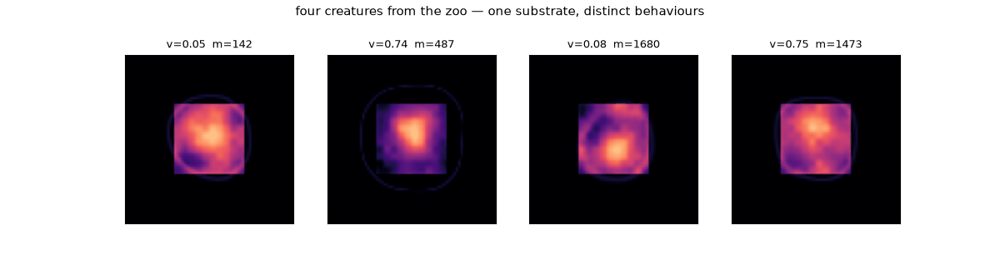

> Honest scope: the zoo spans a clean small glider (low mass) through large multi-blob **foam**
> textures (high mass) — so the behaviour space is filled with viable *patterns*, not all of them
> discrete single organisms; and the map is **bounded** (illumination of a finite space, not a
> claim of *unbounded* open-endedness, which would need a richer, coevolving substrate).

## Round 24 — open-ended minds (a zoo of *strategies*)

Round 22 illuminated a zoo of *body shapes*. This goes one level deeper: keep the body **fixed**
(the evolved glider) and vary the **mind** — a 4-parameter foraging policy (sensing range, speed,
exploration, momentum) — then illuminate the space of foraging *behaviours* (how much it **roams**
× how **widely** its path spreads) with MAP-Elites:

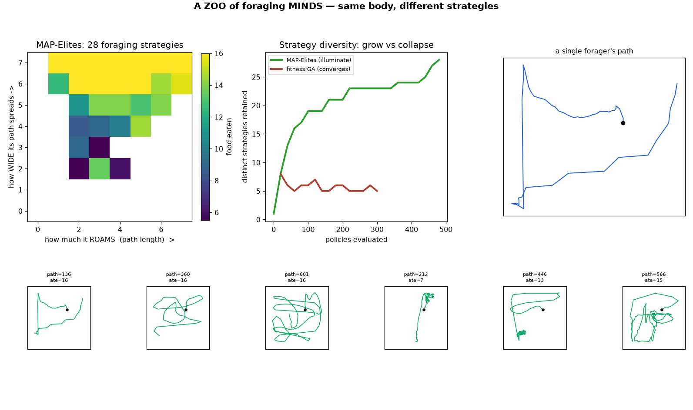

MAP-Elites fills **28 strategy niches** (≈ the reachable maximum) with foragers whose **trajectories
look visibly different** — compact efficient foragers, sprawling rovers, columnar pacers — while the
fitness GA's population diversity collapses to ~**5**. So open-endedness holds for **minds**, not just
morphologies: the same body supports a whole zoo of distinct ways to forage.

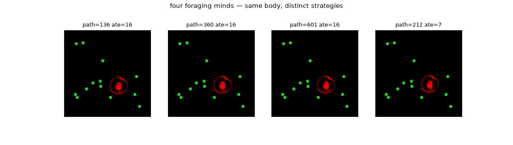

> Honest scope: the reachable behaviour region is a triangle (a low-roaming forager *can't* have a
> wide-spreading path), so ~30/64 is near the ceiling, not a shortfall; and in this small world a
> compact path can eat as much as a long rover, so the diversity is in *style*, not all in success.

## Round 25 — the 3D creature (a compact body found; the glider still open)

Round 5 scaled the *engine* to 3D and got robust self-*organisation* — but never a 3D
*creature* (the analogue of the 2D glider). This round makes one serious push at that
negative, with three upgrades over R5's search: **multi-ring kernels** (what 3D Lenia
creatures actually use), a **shaped viability gradient** (the round-2 fitness hard-gates on
*alive*, giving the search no foothold; partial credit for healthy mass + compactness lets it
climb), and a **motion reward**.

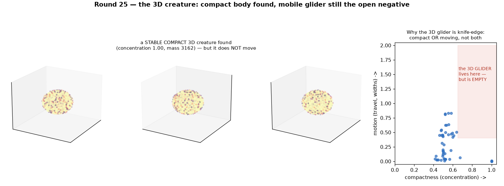

**Result (honest, mixed).** The search now reliably finds a **stable, compact 3D creature** — a
single localised body, concentration **1.00** — a genuine upgrade on R5's diffuse lattice. But a
**mobile** 3D creature (a 3D *glider*) is **still not found**, and the search shows exactly *why*:
the compactness × motion scatter has the two ingredients only **separately** — compact bodies are
**stationary**, and the structures that **move** are **diffuse**. The glider is the empty
**intersection** (compact *and* moving) — the knife-edge that keeps it rare.

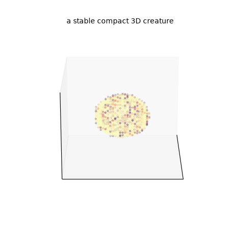

> This *sharpens* R5's negative rather than erasing it: *a* 3D creature, yes; a *moving* one, not
> yet. Reaching it likely needs a richer substrate (differentiable Lenia to gradient-find it, or
> Flow-Lenia) — a dependency this numpy-only project has deliberately not added.

## Round 27 — Flow-Lenia (a mass-conserving substrate)

Round 25 diagnosed *why* the mobile 3D creature is hard: plain Lenia *grows and clips* mass in
place, so it isn't conserved — a moving body **dissipates**, and 3D dynamics are knife-edge.
**Flow-Lenia** (Plantec et al. 2022) fixes the root cause: treat the growth as an *affinity*,
and **move** mass along its gradient with mass-conserving advection instead of growing it. It's
an algorithm, not a package — so it's built here in **pure numpy** (no new dependency):

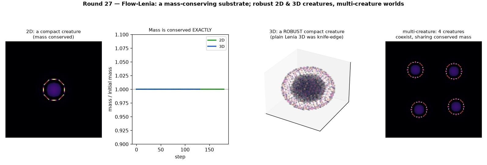

What the conservation buys: **mass is conserved exactly** (a flat line, 2D and 3D); a seed
self-organises into a **compact creature** — with an emergent orbium-like ring in 2D — and,
crucially, into a **robust compact 3D creature** *where plain Lenia 3D died or foamed*; and
**multiple creatures coexist** in one world, sharing the conserved mass.

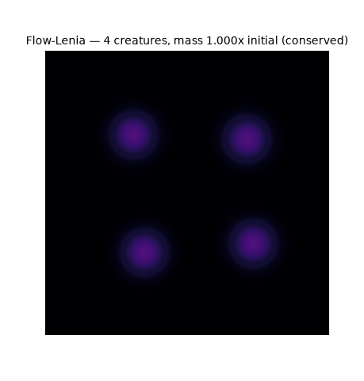

> Honest scope: a *mobile* creature is still not delivered — with a symmetric kernel the clumps
> are stationary attractors, and motion needs a search (as in round 2) or multi-channel kernels.
> But the substrate now *conserves* mass, so a moving body can no longer dissipate — which is
> exactly the obstacle round 25 hit. The mobile creature is *reopened*, not yet caught.

## Round 28 — why the creature won't move (a diagnosis)

The mobile creature has now been attacked three ways — plain Lenia (round 25), symmetric
Flow-Lenia (round 27), and here a proper round-2-style **GA over the rule + kernel asymmetry +
the evolved seed shape**, plus probes with asymmetric kernels and rotated flows. They all land
in the same place, and this round explains *why*:

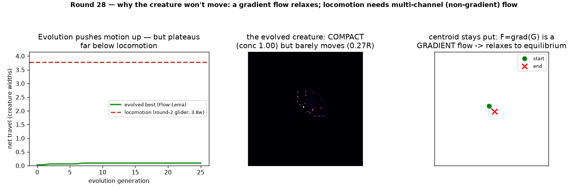

Evolution pushes net travel up — from ~0.06 R (random) to ~0.2 R (evolved) — but **plateaus far
below locomotion** (round 2's plain-Lenia glider crossed **3.78 widths**). The diagnosis: a
single-channel Flow-Lenia moves mass by **F = ∇G**, a *gradient* flow, which is **curl-free** — so
it can only *relax* mass toward a stationary equilibrium. That is exactly why every attempt yields
a **compact but stationary** creature. Sustained locomotion needs a **non-gradient** flow — i.e.
**multi-channel** Flow-Lenia (the paper's glider mechanism), a larger build.

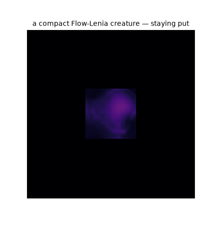

> So the mobile creature is now a *thorough, explained* negative rather than a mystery: three
> substrates, a proper evolutionary search, and a clear mechanism for the wall. The next real
> attempt (multi-channel Flow-Lenia) is a multi-round effort — a genuine fork in the road.

## Round 29 — multi-channel Flow-Lenia (built; the wall holds)

At the fork, the call was to **build multi-channel Flow-Lenia** — the paper's glider mechanism:
several channels, each advected by its own affinity gradient and **coupled** through cross-channel
kernels, so the combined system is no longer a single gradient. It's built (`flowlenia_mc.py`) and
it works — structured **2-channel coupled creatures** form and each channel conserves its own mass:

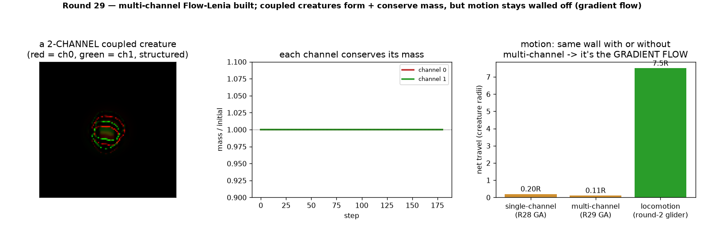

But a serious GA over the coupling reached only **0.11 R** of travel, and a less-diffusive
**reintegration-tracking** advection (the suspected culprit) gave the same. **Motion hits the same
wall with or without multi-channel** — so the binding constraint really is the **gradient flow**
(it relaxes to a stationary equilibrium), not the channel count or the advection scheme.

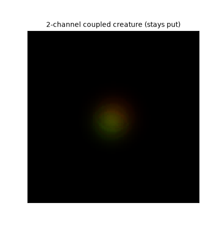

> So the mobile creature is now an *exhaustively* tested negative: plain Lenia, Flow-Lenia
> (single- and multi-channel), two advection schemes, proper evolutionary searches — all
> stationary, all explained by one mechanism. The remaining real path is **differentiable Lenia**
> (gradient-descend through the dynamics to *find* a glider), which needs a deep-learning
> dependency — a gate this numpy-only project leaves to a deliberate decision.

## Round 30 — emergent communication (two agents evolve a shared code)

The whole mind arc so far was *single-agent*. Communication needs two — and is a hallmark of
intelligence. A **speaker** sees a hidden referent (one of K = 4) and emits a continuous 2-D
**signal**; a **listener** sees only the signal and must name the referent. Neither is given a
code — both networks are **evolved jointly**, and a shared language *emerges*:

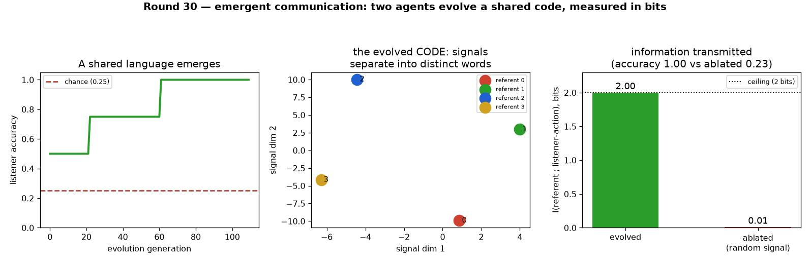

Listener accuracy climbs from chance (0.25) to **1.00**; the four signals separate into distinct
**"words"** in signal space; and the realised information **I(referent ; listener-action) = 2.00
bits**, the `log2(K)` ceiling. Feed the listener a *random* signal and it collapses to chance
(accuracy 0.23, 0.01 bits) — so the channel is genuinely **used**, not a confound.

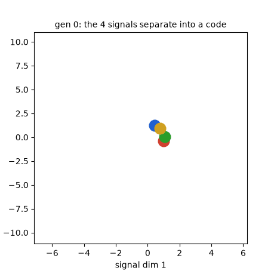

> This reopens the *intelligence* frontier into a new dimension — **social / multi-agent** — that
> the single-agent mind arc never touched. (When the mobile-creature sub-goal hit a wall, the core
> goal still had whole ungated dimensions left; this is one of them.)

## Round 31 — compositional communication (does the language factorise?)

A referent now has **two attributes** (3 shapes × 3 colours), and the speaker must convey both.
The deep question: is the emerged code **compositional** — built from reusable parts, so *unseen*
combinations decode zero-shot — or **holistic** (each combo an arbitrary code)?

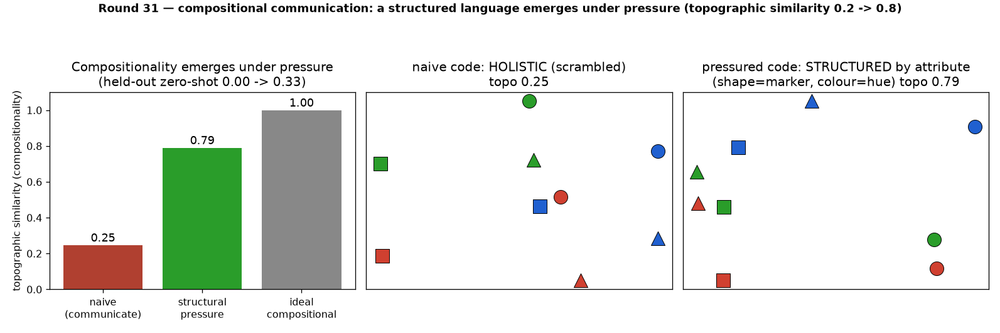

The naive emerged code (round 30's trick) is **holistic**: perfect on training meanings, but
held-out zero-shot **0.00** and topographic similarity only **0.25** — it *memorises* each meaning.
Add a **structural pressure** (reward topographic similarity) and the language becomes
**compositional**: topographic similarity **0.25 → 0.79**, the signals organise by attribute, and
partial zero-shot generalisation appears (**0.00 → 0.33**).

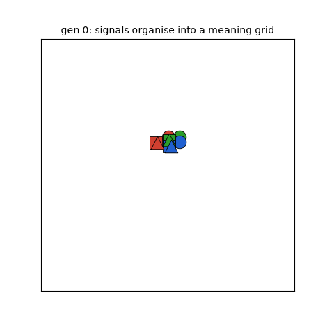

> So compositionality — the property that lets *finite* parts express *infinite* meanings — is **not
> free** from communicative success alone; it emerges under a learnability/structure pressure (a
> known emergent-language result, here in pure numpy). Honest scope: the speaker's code becomes
> compositional, but the *listener's* zero-shot decoding lags, so generalisation is partial.

## Round 33 — grounded communication (a signal that drives foraging)

Rounds 30–31 communicated abstract labels. Here the signal is **grounded in action**: a **scout**
sees where food is and emits a signal; a **blind forager** sees only the signal and must navigate
to the food. The pair is **evolved jointly**:

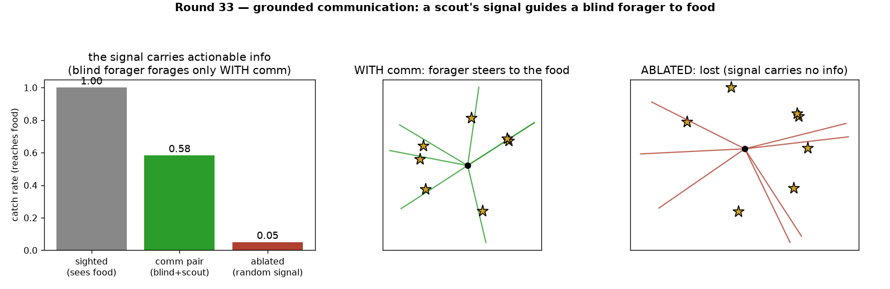

A *sighted* forager (sees food itself) catches it every time (1.00). The **blind forager + scout
pair** reaches food **0.58** of the time — but **ablate the channel** (feed a random signal) and it
collapses to **0.05**, lost. The trajectories make it vivid: with the channel the forager steers
straight to the food; ablated, it scatters at random. So the emitted signal carries **actionable
spatial information a body uses to forage** — the first communication here that *does* something in
the world, fusing the embodied track (navigation) with the social track (signalling).

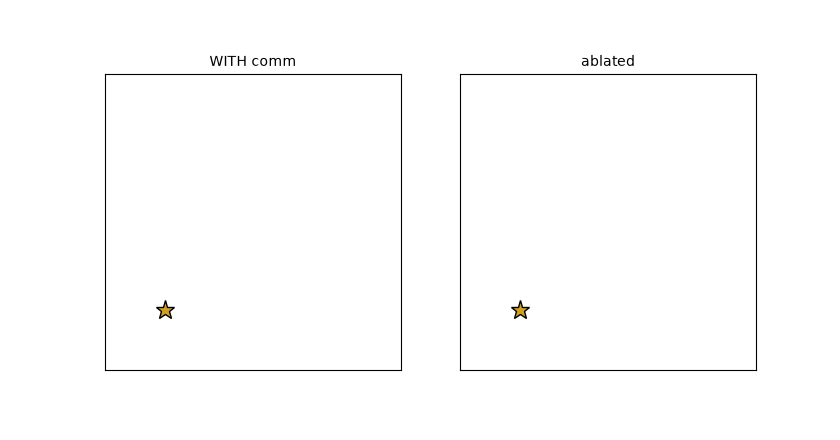

## Round 34 — iterated learning (compositionality from cultural transmission)

Round 31 made language compositional with a *hand-added* structural reward. The principled
mechanism (Kirby et al.) needs no such term: **cultural transmission through a learnability
bottleneck**. Each "generation" learns the language (a tanh-MLP, trained by hand-coded numpy
backprop) from only a **subset** of meanings, then must produce *all* of them — generalising to
the ones it never saw. Holistic codes can't be reconstructed from few examples and degrade;
compositional ones survive:

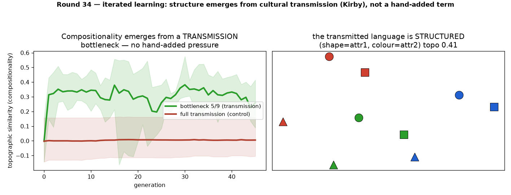

Under the **bottleneck** (learn from 5 of 9 meanings), topographic similarity rises from ~0 to
**~0.35** over generations; under **full transmission** (all 9) it stays flat at ~0. So
compositional structure emerges from **transmission alone** — no structure term added — because
compositional languages are *learnable from few examples* and holistic ones are not.

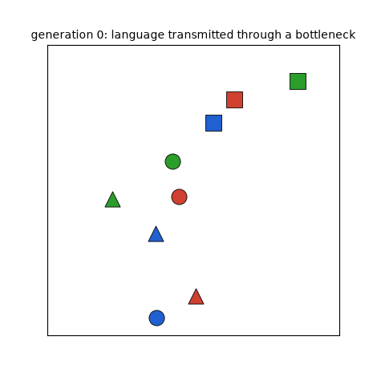

> So R31's hand-added pressure was a stand-in for a real mechanism: the bottleneck of passing a
> language to the next learner. Honest scope: the emergent effect (~0.3) is more modest than R31's
> forced 0.79 and fluctuates across runs; the bottleneck-vs-full *contrast* is the robust claim.

## Round 35 — theory of mind (infer a hidden goal from behaviour)

A social ability *distinct* from communication: reading another agent's mind. An **actor** moves
toward one of four hidden goals with heavy noise; an **observer** (a recurrent net) sees only the
actor's step-by-step **motion** — no absolute position — and must infer *which* goal it intends:

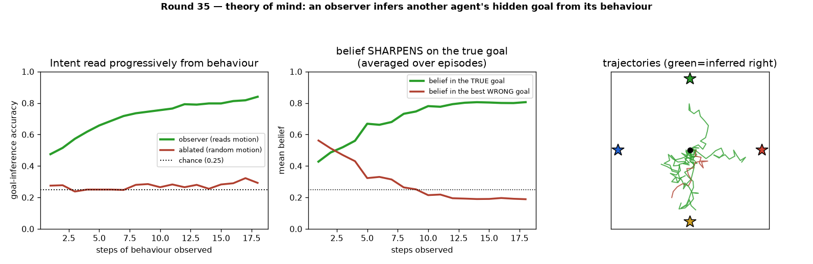

The observer reads intent **progressively** (accuracy **0.48 → 0.84** as it watches), its **belief
sharpens** on the true goal (mean belief 0.43 → 0.81, while the best wrong goal falls 0.56 → 0.19),
and **ablating the observation** (random motion) drops it to **chance**. It integrates noisy
behaviour into a belief about intent — mentalising.

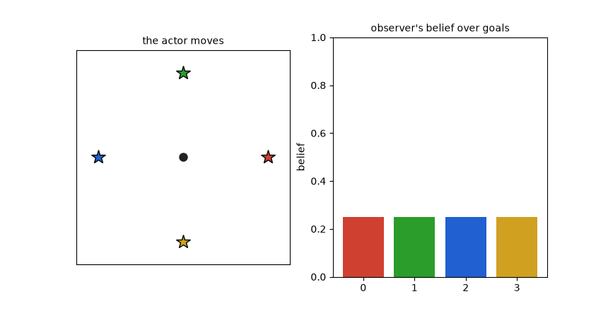

> Honest scope: inferring *which target an agent walks toward* is partly geometric — a position
> oracle also solves it, because the actor cooperatively reveals its goal. The real result here is
> the *learned* belief-updating from motion alone and its dependence on observing. The harder ToM
> (behaviour that *misleads* — detours around obstacles) is a future frontier.

## Round 37 — multi-agent coordination (division of labour)

Communication and mind-reading are in place; the last social piece is **acting together**. A team
of N agents must **cover** N food sites — the team's yield is the number of *distinct* sites
occupied (a doubled-up site wastes an agent). With distinct roles, the team evolves a **division of
labour**:

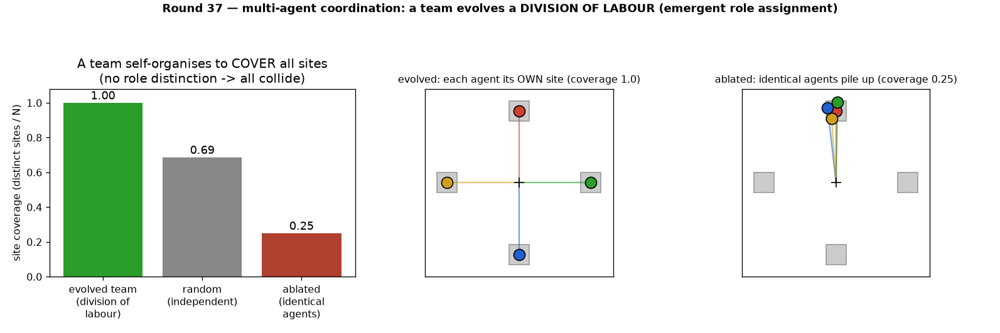

The evolved team learns a **permutation** — each agent claims its own site, **coverage 1.00** —
beating an independent-random team (~0.69, some collide by chance) and crushing an **ablated**
identical team (**0.25**, all pile onto one site). Coordination needs **broken symmetry**, and the
assignment is an *emergent convention* (a different permutation each run).

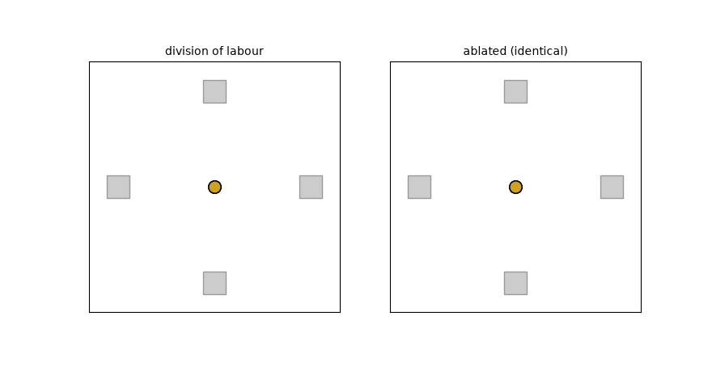

> Honest scope: the role distinction is *given* (each agent has an id) — symmetry-breaking *from
> scratch* (identical agents differentiating with no id) is a harder frontier. A comm-rendezvous
> variant was tried first but collapsed into a fixed convention / one-way communication; division of
> labour is the cleaner, genuinely-distinct coordination result.

## Round 38 — harder theory of mind (intent when behaviour misleads)

Round 35's observer read intent from motion — but a position oracle did just as well, because the
actor walked *straight* at its goal. Here the actor must **detour around a central obstacle** to
reach goals behind it, so its early motion points *away* from the goal — surface behaviour
**misleads**:

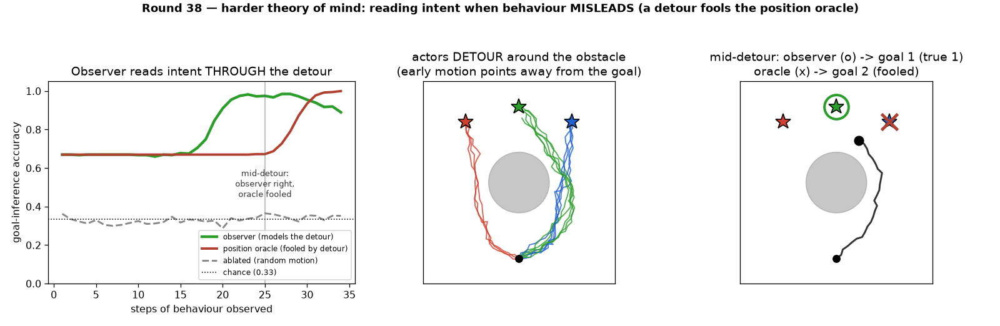

While the actor is **mid-detour** (still on the wrong side), the observer — which has learned the
obstacle and the go-around policy — already infers the true goal (**0.97**), while the **position
oracle is fooled** (0.67), guessing whichever goal the actor is currently nearest. The oracle only
catches up once the actor *arrives*; over the whole trajectory the observer wins (**0.80 vs 0.73**),
and ablating the observation drops it to chance.

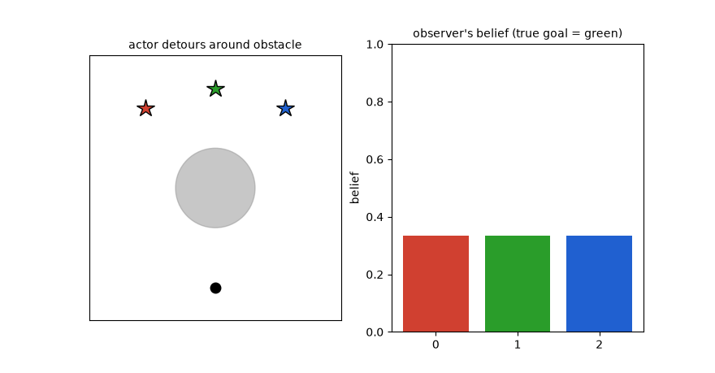

> This is the genuine theory of mind R35 lacked: **modelling goal-directed behaviour beats a position
> heuristic** precisely because the behaviour points the wrong way. (Honest: the oracle still wins at
> the trivial final step, when the actor has arrived — the observer's edge is reading intent *early*.)

## Round 40 — unified social world (communicate AND coordinate)

Rounds 30–38 each isolated *one* social faculty. This round is their **capstone** — the multi-agent
analogue of round 21, which unified memory + prediction + planning into one organism where every
faculty is load-bearing. Here a team forages a world where each round a few sites are **rich**, but
only a **scout** sees which; it must signal a team that has **fewer foragers than sites**, so they
can't blanket everything — they must *choose* the rich sites and *split* across them:

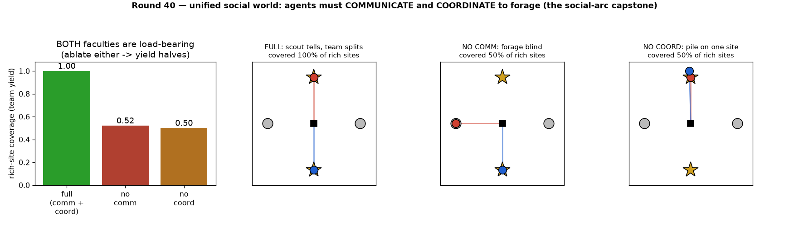

Full yield needs **both** faculties. With communication *and* coordination the team covers every rich
site (**1.00**); **ablate the channel** and it forages blind, missing rich sites (**0.52**); **ablate
the role-split** and both foragers pile onto one site (**0.50**). Each social faculty is load-bearing
— ablate either and the yield halves.

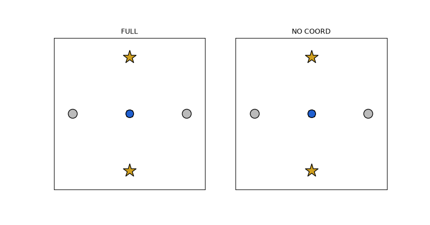

> Just as round 21 proved the single mind's faculties *compose and each is necessary*, this proves it
> for the social mind: communication and coordination aren't separate party tricks — together they let
> a group forage what no isolated faculty could. (Honest design note: it only works with *fewer*
> foragers than sites — otherwise the team blankets everything and communication becomes unnecessary.)

## Round 41 — cumulative culture (the ratchet)

Round 34 showed a *fixed* language survives cultural transmission. The deeper phenomenon — the one
that makes human culture unique — is **cumulative improvement**: each generation inherits the
previous artifact, innovates a *bounded* amount in one lifetime, and passes on a slightly better one,
so skill **ratchets up** past anything a single lifetime could reach:

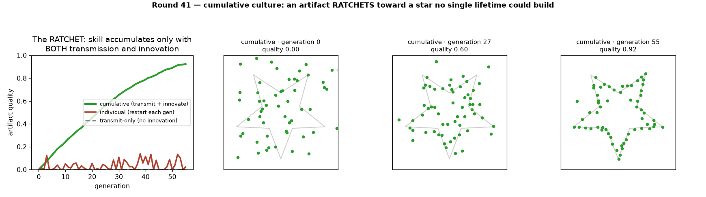

With **both transmission and innovation**, the artifact (a cloud of points) ratchets from a random
blob into a sharp five-pointed **star** — quality **0 → 0.92**. Take away either ingredient and the
ratchet breaks: **individual** learning (innovate but restart each generation) is stuck at the
single-lifetime ceiling (~0.05, never accumulates), and **transmit-only** (copy faithfully, never
innovate) never improves at all (~0.00). The star is something no one lifetime here could build.

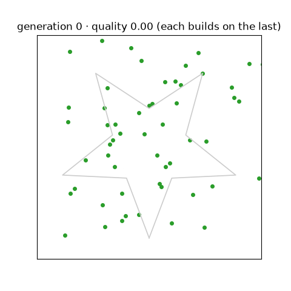

> This is Tomasello's *ratchet effect*: cumulative culture needs **faithful transmission AND
> innovation** together. (Honest scope: the artifact matches a *given* target shape — a truly
> open-ended ratchet that *invents* its own complexity is a deeper frontier.)

---

## How it works

- **Engine** (`genesis/world.py`) — `World(shape, LeniaParams)`: an N-D field, an FFT
  radial-kernel convolution and a Gaussian growth map. Same code in 1D/2D/3D.
- **Metrics** (`genesis/metrics.py`) — emergence measured, not assumed: alive /
  localized / persistent / locomotion, plus a scale-aware **mass-concentration** that
  tells one compact creature from space-filling turbulence. All dimension-agnostic.
- **Evolution** (`genesis/evolve.py`) — a `(μ+λ)` GA over an `Individual` = rule
  (`LeniaParams`) + an evolvable **seed morphology** (a small smooth patch).
- **Agency + survival** (`genesis/foraging.py`) — `ForagingWorld` adds a food field, a
  sensing kernel, a sensorimotor drift reflex, eating, and a scalar **energy reserve**
  (metabolism drains it, food refills it, zero = death). `genesis/run3.py` evolves the
  forager (agency benchmark); `genesis/run4.py` turns on metabolism (survival benchmark).

## Run

```bash
uv venv --python 3.12 && uv pip install -e ".[dev]"

.venv/bin/python -m genesis.run1d         # 1D self-organisation
.venv/bin/python -m genesis.run2d --gif   # evolve a 2D glider, render strip + gif
.venv/bin/python -m genesis.run3  --gif   # evolve a forager, agency benchmark + gif
.venv/bin/python -m genesis.run4  --gif   # turn on metabolism, survival benchmark + gif
.venv/bin/python -m genesis.run5_3d --gif # 3D self-organisation + rotating gif
.venv/bin/python -m genesis.run6  --gif   # ecology / competition + gif
.venv/bin/python -m genesis.run7  --gif   # evolution running inside the ecology + gif
.venv/bin/python -m genesis.run8  --gif   # predator-prey + gif
.venv/bin/python -m genesis.run9  --gif   # within-lifetime learning + gif
.venv/bin/python -m genesis.run11 --gif   # embodied learning (brain in a Lenia body) + gif
.venv/bin/python -m genesis.run12 --gif   # measuring the mind: I(brain;world) in bits + gif
.venv/bin/python -m genesis.run13 --gif   # learning under selection (does knowing win?) + gif
.venv/bin/python -m genesis.run14 --gif   # the Baldwin effect (evolving the learning rate) + gif
.venv/bin/python -m genesis.run15 --gif   # a brain with memory (recurrent cue-recall) + gif
.venv/bin/python -m genesis.run16 --gif   # a brain that predicts (recurrent forecasting) + gif
.venv/bin/python -m genesis.run18 --gif   # embodied memory (recurrent brain in a Lenia forager) + gif
.venv/bin/python -m genesis.run19 --gif   # planning / interception (act on foresight) + gif
.venv/bin/python -m genesis.run21 --gif   # unification: one creature, all faculties (ablation) + gif
.venv/bin/python -m genesis.run22 --gif   # open-endedness: MAP-Elites zoo vs fitness converges + gif
.venv/bin/python -m genesis.run24 --gif   # open-ended minds: a zoo of foraging strategies + gif
.venv/bin/python -m genesis.run25 --gif   # the 3D creature: compact body found, mobile glider open + gif
.venv/bin/python -m genesis.run27 --gif   # Flow-Lenia: mass-conserving substrate (robust 3D, multi-creature) + gif
.venv/bin/python -m genesis.run28 --gif   # why it won't move: the gradient-flow motion diagnosis + gif
.venv/bin/python -m genesis.run29 --gif   # multi-channel Flow-Lenia: coupled creatures; motion walled + gif
.venv/bin/python -m genesis.run30 --gif   # emergent communication: two agents evolve a shared code + gif
.venv/bin/python -m genesis.run31 --gif   # compositional communication: structure under pressure + gif
.venv/bin/python -m genesis.run33 --gif   # grounded communication: scout guides a blind forager + gif
.venv/bin/python -m genesis.run34 --gif   # iterated learning: compositionality from transmission + gif
.venv/bin/python -m genesis.run35 --gif   # theory of mind: infer a hidden goal from behaviour + gif
.venv/bin/python -m genesis.run37 --gif   # multi-agent coordination: division of labour + gif
.venv/bin/python -m genesis.run38 --gif   # harder theory of mind: a detour fools the position oracle + gif
.venv/bin/python -m genesis.run40 --gif   # unified social world: communicate AND coordinate + gif
.venv/bin/python -m genesis.run41 --gif   # cumulative culture: the ratchet builds a star + gif
.venv/bin/python -m genesis.overview      # rebuild the progress montage
.venv/bin/python -m pytest -q             # engine + evolution + foraging invariants
```

Outputs (figures, GIFs, evolved genomes) are written to `outputs/`.

## Layout

```
genesis/
  world.py      dimension-agnostic Lenia engine
  metrics.py    emergence + concentration metrics (any dimension)
  evolve.py     co-evolution of rule + seed morphology (2D)
  evolve3d.py   3D morphology GA (PATCH^3 seed + rule)
  foraging.py   food field + sensorimotor reflex + metabolism (agency, survival)
  ecology.py    many creatures sharing one food field (competition)
  evo_ecology.py  heritable gain + birth/death/mutation (evolution running)
  predprey.py   two species: prey + predators (co-evolution, regulation)
  learning.py   a plastic value-learning brain (within-lifetime, reversal)
  embodied_learning.py  the plastic brain inside a Lenia creature (round 11)
  measure.py    information-theoretic measures of mind (I(brain;world), bits)
  evo_learning.py  learners vs fixed-reflex creatures compete (evolution of learning)
  baldwin.py    a heritable learning rate (the Baldwin effect)
  memory_brain.py  a recurrent controller with memory (evolved by ES)
  predict_brain.py  a recurrent controller that predicts the next world-state
  embodied_memory.py  a recurrent brain driving a Lenia forager (memory pays)
  planning.py   acting on foresight: intercept a moving target (pursuit vs planner)
  unified.py    one creature integrating body+memory+prediction+planning (ablation)
  openended.py  MAP-Elites illuminating a behaviour-space zoo (open-endedness)
  openmind.py   MAP-Elites over foraging policies — a zoo of strategies (open-ended minds)
  creature3d.py  multi-ring + shaped search for a 3D creature (compact found, glider open)
  flowlenia.py  Flow-Lenia: mass-conserving substrate in numpy (robust 3D + multi-creature)
  creature_flow.py  GA for a mobile Flow-Lenia creature (the gradient-flow negative)
  flowlenia_mc.py  multi-channel Flow-Lenia (coupled channels; mass conserved per channel)
  communicate.py  emergent communication: two agents evolve a shared code (ES)
  communicate_comp.py  compositional communication (2-attribute referents; topo pressure)
  communicate_grounded.py  grounded communication: scout signals food, blind forager navigates
  communicate_iterate.py  iterated learning: compositionality from a transmission bottleneck (Kirby)
  theory_of_mind.py  infer another agent's hidden goal from its behaviour (mentalising)
  coordinate.py  multi-agent coordination: a team evolves a division of labour
  tom_obstacle.py  harder theory of mind: read intent when a detour misleads
  unified_social.py  unified social world: communicate AND coordinate (both load-bearing)
  cumulative_culture.py  cumulative culture: the ratchet (transmission + innovation)
  run1d.py … run41.py   round drivers + visualisation
  overview.py   stitches the per-round figures into one progress montage
tests/          engine (1D/2D/3D) + evolution + foraging invariants
docs/           STATUS.md + progress.md (autonomous-loop resume state)
outputs/        figures, GIFs, evolved genomes
```

## Method note

Built autonomously, round by round, under a simple rule: **never trust a metric — run
the world and look at it.** Every round here records its honest dead ends (a soup that
gamed the locomotion metric; three failed taxis couplings) right next to what worked, in
`docs/progress.md`.
